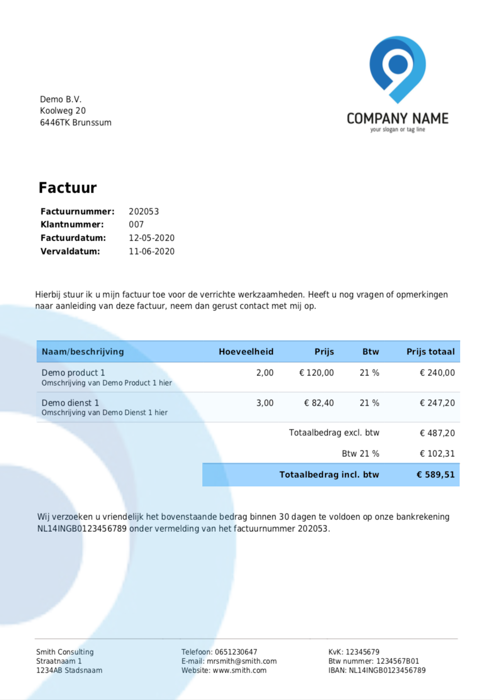

# ToPay
Detects if image contains invoice.

Result for this image:

It has the following characteristics: kvk, factuur, factuurnummer, factuurdatum, verval, klant, btw,
Trying to match the characteristics with their value

InvoiceNumber = 202053.
InvoiceDate = 12-05-2020
InvoiceExpireDate = 11-06-2020
CustomerNumber = 007
KvK = 12345679
BTW = 1234567B01
